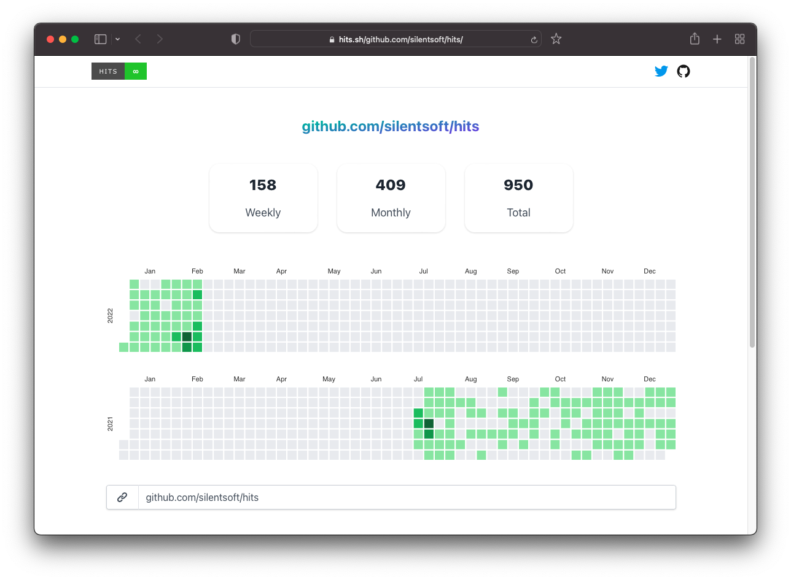

<h1 align="center">
  Hits</br>
  <a href="https://status.hits.sh"></a>
  <a href="https://status.hits.sh"></a>
</h1>
<h3 align="center">
  <a href="https://hits.sh"></a>
</h3>

## Getting Started
`Hits` supports the following three of the most common use cases: `Markdown`, `HTML` and `Image Link`.

For example, to get a hits badge for `https://github.com/silentsoft/hits`:

[(https://hits.sh/appliedopticsun.github.io/hits/)

- Markdown
  ```markdown
  [](https://hits.sh/appliedopticsun.github.io/hits/)
  ```
- HTML
  ```html
  https://hits.sh/appliedopticsun.github.io/hits
  <a href="https://hits.sh/appliedopticsun.github.io/hits/"></a>
  ```
- Image Link
  ```
  https://hits.sh/appliedopticsun.github.io/hits.svg
  ```

## Features in Query String

### view
- `total` (default)
- `today-total`

### style
- `flat` (default)
- `flat-square`
- `for-the-badge`
- `plastic`

### label
- For setting the label text instead of the default `hits`.

### extraCount
- This is useful if you want to add an extra count to your badge. For example, if you want to add a count of `1000` to your badge, you can set `extraCount=1000`.
- **When Do I Need This?**
  - If the hit counter service you used previously has end-of-service, you can start with any number instead of starting from 1.

### color, labelColor
- Named color by shields.io

  
  
  
  
  
  
  
  
  
  
  
  
  
  
  
  

- Any valid [CSS color](https://developer.mozilla.org/en-US/docs/Web/CSS/color_value)
  - named color
    - 
    - 
    - etc.
  - hexadecimal numbers
    - 
    - 
    - etc.
  - rgb[a](red, green, blue[, opacity])
  - cmyk[a](cyan, magenta, yellow, black[, opacity])
  - hsl[a](hue, saturation, lightness[, opacity])

### logo
- [simple-icons slug](https://github.com/simple-icons/simple-icons/blob/develop/slugs.md)
- or data:image/svg+xml;base64,..

## Statistics
You can see the statistics of your website by replacing the `.svg` with `/` in the URL you used to get the badge.

For example, to get a statistics for `https://github.com/silentsoft/hits` then visit [https://hits.sh/github.com/silentsoft/hits/](https://hits.sh/github.com/silentsoft/hits/)



## Installation
```
$ git clone https://github.com/silentsoft/hits.git
$ cd hits
$ mvnw spring-boot:run
```


## Packaging
```
$ mvnw clean package -P production
```

## Contributing
Pull requests are welcome. For major changes, please open an issue first to discuss what you would like to change.

Please note we have a [CODE_OF_CONDUCT](https://github.com/silentsoft/hits/blob/main/CODE_OF_CONDUCT.md), please follow it in all your interactions with the project.

## License
Please refer to [LICENSE](https://github.com/silentsoft/hits/blob/main/LICENSE.txt) and [NOTICE](https://github.com/silentsoft/hits/blob/main/NOTICE.md).

## Thanks to
<a href="https://jb.gg/OpenSourceSupport"></a>
